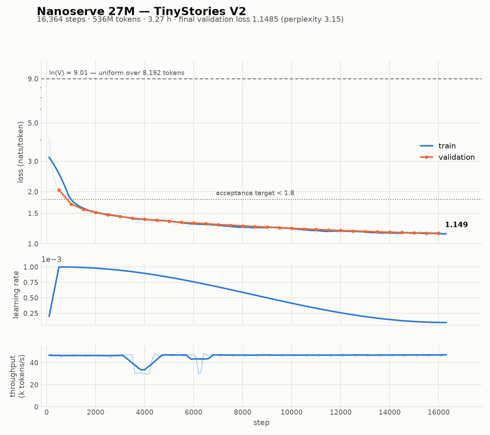

# Phase 1 — Training a 27M-parameter language model from scratch

A decoder-only transformer, a byte-level BPE tokenizer, and a training loop —
all written by hand, no `AutoModel` and no `tokenizers` library. Trained on
TinyStories V2 on a single 4 GB laptop GPU in 3.27 hours.



| | |
|---|---|
| Parameters | 26,747,392 |
| Training tokens | 536,174,127 |
| Final validation loss | **1.1485 nats/token** |
| Perplexity | **3.153** |
| Wall clock | 3.27 h on an RTX 3050 Laptop (4 GB) |
| Throughput | 47,000 tokens/s sustained |

The acceptance bar was < 1.8 nats/token and grammatical English. Both met.

---

## 1. Architecture

Llama-style decoder-only, written out in `model/transformer.py`.

| | |
|---|---|
| `d_model` / layers / heads | 512 / 8 / 8 |
| KV heads | 2 (grouped-query attention) |
| `d_ff` | 1408 (SwiGLU) |
| Norm / position | RMSNorm pre-norm / RoPE |
| Vocabulary / context | 8,192 / 1,024 |
| Embeddings | tied |

### Why these choices

**Grouped-query attention with 2 KV heads** is the decision that Phase 2 depends
on. Four query heads share each KV head, so the cache stores 2 heads rather
than 8. That makes the KV cache exactly **4 KB per token** — a 16-token block is
64 KB, and a full 1,024-token sequence is 4 MB. With full multi-head attention
every memory number in the serving engine would be four times worse.

**Tied embeddings.** Untied, the model is 30.9M parameters, because the output
projection gets its own 4.2M weights — 15% of the model — to memorise a
vocabulary the embedding table already encodes. Tied, it is 26.7M.

**RMSNorm reduces in fp32.** Not defensive decoration. In fp16 an activation of
1e3 squares to 1e6, which overflows to `inf`; the mean is then `inf`,
`rsqrt(inf)` is 0, and the layer returns **all zeros**. The output is perfectly
finite, no NaN propagates, nothing raises — and the model simply does not learn.
`tests/test_cache_boundary.py` asserts the value, not just finiteness, because
finiteness would pass.

**Depth-scaled residual init.** Both projections that write into the residual
stream (`o_proj`, `down_proj`) are scaled by `1/sqrt(2 · n_layers)` at
initialisation. Without it the residual stream's variance grows with depth and
late layers train against an already-saturated signal.

### Verification

The week-1 gate was not "the loss goes down" — a model with a subtly wrong RoPE
or an off-by-one causal mask still trains, just worse, and you find out three
days into a run. Instead, `tests/test_parity.py` builds the same architecture in
HuggingFace's `LlamaForCausalLM`, copies one set of weights into both, and
requires:

- logits agreeing to **2e-5** across a batch
- greedy generation matching **token for token**
- incremental decode with a KV cache equalling a single full forward pass
- chunked prefill equalling a single full forward pass

Parameter names mirror HuggingFace's Llama, so that check is a plain
`load_state_dict` rather than a conversion script — and exporting weights later
needs no remapping.

`tests/test_cache_boundary.py` covers the failure mode that still produces
fluent text: decoding position 412 with 411 cached, a sweep across the 16-token
block edges Phase 2's allocator will cross, and 256 sequential decode steps
checked at *every* position rather than only the last. One test catches RoPE
stuck at position 0 by requiring the same token to give different logits at
position 10 and position 400.

---

## 2. Tokenizer

Byte-level BPE, trained from scratch in `model/tokenizer.py`.

**Byte-level base vocabulary.** The 256 byte values are the starting alphabet,
so every possible input is representable, there is no UNK token, and no
out-of-vocabulary code path exists to get wrong.

**Pre-tokenization before BPE.** Text is split on a regex first and merges never
cross those boundaries. Without it BPE happily learns `". The"` as a single
token and the vocabulary fills with punctuation-glued fragments. The pattern is
GPT-2's, rewritten for Python's stdlib `re` — `[^\W\d_]` stands in for `\p{L}`,
which avoids a third-party dependency for one character class.

**Training on a frequency table, not the token stream.** This is what makes a
hand-written BPE practical rather than a multi-hour ordeal. Collapsing the
corpus to unique pre-token → count first turns 530M pre-tokens into 59,888 rows,
after which each merge costs work proportional to the number of *distinct* words
containing the pair.

### Why 8,192

Not arbitrary. TinyStories deliberately uses roughly the vocabulary "a child
would use"; published replications find the top 8k tokens cover 475.5M of 476.6M
tokens — 99.8%. Measured here on held-out text:

| | |
|---|---|
| Compression | **3.965 bytes/token** |
| Words encoding to a single token | **98.1%** |
| Round-trip on held-out text | exact |

Longest learned tokens are whole words: `' accomplishment'`,
`' compassionate'`, `' refrigerator'`, `' veterinarian'`.

### An honest finding

Training the tokenizer on the full 2.07 GB corpus took 16.4 minutes and gave
3.965 bytes/token. Training it on only the 21.5 MB validation split took **25
seconds** and gave 3.970. Sixteen minutes bought 0.1%.

That is the diminishing-returns result reproduced on our own data, and it has a
practical consequence: vocabulary-size experiments can iterate on a sample in
seconds rather than waiting on the full corpus.

---

## 3. Data

TinyStories V2 (GPT-4 generated only; V1 mixes in lower-quality GPT-3.5
generations, per the dataset card).

| | |
|---|---|
| Source | 2.07 GB, 2,717,494 stories |
| Tokenized | 536,174,127 tokens, 1.00 GB as `uint16` |
| Validation | 5,414,488 tokens, 27,629 stories |
| Mean story length | ~198 tokens |

**536.2M tokens against a Chinchilla-optimal 535M for 26.75M parameters** — a
0.2% miss, with no tuning. The token budget worked out on its own.

**`uint16`, not `int32`.** 8,192 ids fit in 16 bits, so the token file is 1.0 GB
instead of 2.1 GB. `prepare()` raises rather than let a larger vocabulary wrap
silently at 65,536.

**Packed and flat, not padded per document.** Stories average ~198 tokens
against a 1,024-token context, so padding each one would spend most of every
batch on padding. Random windows are sampled from the flat stream; windows do
straddle document boundaries, and the EOS token is what teaches the model that
the text before it does not predict the text after.

### Two things found by looking at the corpus

**The official train/valid split cuts a story in half.** The train file ends
mid-word inside "You" and the valid file opens with `u don't have to be scared
of the loud dog...`. It is a byte offset, not a document boundary — the same
story, both sides. One story in 2.7M is a negligible leak, but
`drop_first_document` / `drop_last_document` remove it, and "we checked" beats
"probably fine".

**Chunked reading loses a document per chunk if the trailing partial document
is not carried across reads.** Tested with the chunk size forced to 64 bytes so
that nearly every document straddles a boundary.

---

## 4. Training

```
optimizer   AdamW(betas=(0.9, 0.95), weight_decay=0.1)  -- fused
lr          1e-3, cosine to 1e-4, 500-step linear warmup
grad_clip   1.0
batch       micro 8 x accum 4 x seq 1024 = 32,768 tokens/step
steps       16,364  (exactly one epoch)
precision   bf16 autocast, fp32 master weights
```

**No `GradScaler`.** The RTX 3050 is Ampere, so bf16 is native and carries
fp32's exponent range. The fp16 loss-scale-collapse failure mode simply does not
exist on this hardware.

**Weight decay on matrices only.** Decaying a norm gain or a bias pulls it
toward zero, which changes the function the layer computes rather than
regularising it. Only parameters with 2+ dimensions are decayed.

### Resumability, built first

A 3-hour run on a laptop will meet a thermal event, a Windows update, or a
closed lid. A checkpoint carries model weights, AdamW's two moment buffers, the
step counter, torch and CUDA RNG state, and the data sampler's generator state.
Written to a temp file and renamed, because a half-written checkpoint is worse
than none — it looks resumable.

The test that proves it: **10 steps + checkpoint + 10 steps produces
bit-identical weights to 20 steps straight through.** A companion test
deliberately drops the optimizer moments on reload and *requires* the result to
differ, so the main test cannot pass vacuously.

### Choosing the batch size

Inference memory says nothing about training memory. Before a single activation
exists, the optimizer state is already 408 MB (fp32 weights + gradients + two
AdamW moment buffers, 102 MB each). Measured on 4 GB at `seq_len=1024`:

| micro-batch | tok/s | peak MB | |
|---:|---:|---:|---|
| 1 | 17,811 | 730 | |
| 4 | 26,860 | 1,781 | |
| **8** | **28,715** | **3,116** | fastest |
| 12 | 13,350 | 4,518 | over-commits VRAM |
| 16 | 6,938 | 5,855 | over-commits VRAM |
| 24 | 2,485 | 8,586 | over-commits VRAM |
| 32 | OOM | | |

**On Windows, exceeding VRAM does not raise.** The WDDM driver backs the
allocation with system RAM over PCIe, so micro-batch 24 "fits" and runs 12×
slower. A benchmark that reports the largest size which does not crash would
recommend the single worst option in the table. `scripts/bench_train_step.py`
reports the fastest and flags spill explicitly.

---

## 5. Performance

Getting from the first working loop to the final one was 2.5×, in three steps —
and only one of them was code.

| | tok/s | 536M tokens |
|---|---:|---:|
| First measurement | 18,800 | 7.9 h |
| On AC power | 29,400 | 5.0 h |
| **`torch.compile`** | **47,000** | **3.2 h** |

**The power one was not a code change.** A benchmark measured 28,715 tok/s; the
training loop measured 18,800. Re-running the *benchmark's own recipe* gave 435
ms where it had given 285 ms — identical code, different answer. Sampling during
a sustained run showed the GPU was not thermally limited (62 °C) but pinned at
exactly 30.0 W with the clock at ~1,000 MHz of 2,100. The laptop was on battery,
where the GPU enforces 30 W of a 60 W default. On AC it enforces 75 W and clocks
at ~1,950 MHz. Both measurements were correct; they measured two different
machines.

**`torch.compile` gave 1.61×.** An eager step launches ~700 tiny kernels;
inductor fuses them into a handful. Numerically equivalent: from the same seed,
step 60 gave loss 5.1541 eager and 5.1538 compiled — fused-kernel reduction
order, not a behaviour change. Requires Triton, which PyTorch does not ship on
Windows; installed separately as `triton-windows`.

`self.model` stays the uncompiled module and is the only thing ever saved.
`torch.compile` returns a wrapper whose `state_dict` keys carry an `_orig_mod.`
prefix, which would make every checkpoint incompatible with an uncompiled run.

**Two host syncs found and removed.** `int(position_ids.max())` in the RoPE
table's auto-grow read a GPU value on the host once per forward pass. `loss.item()`
inside the gradient-accumulation loop cost 36 ms per micro-batch — 145 ms per
step, ~8% of step time — draining the CUDA queue for a number used only every
10 steps. Both were written by me; the second after having already found the
first.

---

## 6. Results

Validation tracks training almost exactly for the entire run, with no widening
gap. That is what a Chinchilla-optimal token budget buys: the model has enough
data that it never has to memorise.

Sampled at `temperature=0.8, top_k=50, top_p=0.95`:

> **Once upon a time, there was a little girl named Lily who** loved to dress up.
> She had a big box of clothes in her room. One day, Lily found a shiny gold
> dress in the box. She put on the dress and it was so pretty.
>
> Lily showed her mom the gold dress. Her mom said, "Wow, Lily! You are very
> lucky!" Lily felt happy and proud. She wanted to show her friends at school.
> So, she put on the dress and went to school.
>
> At school, Lily met her friend, Ben. Ben was sad because he didn't have a
> dress to wear. Lily thought for a moment and decided to share her gold dress
> with Ben. Ben smiled and said, "Thank you, Lily!"

Coherent narrative, consistent characters, correct dialogue punctuation, and an
unprompted sharing arc — from 27M parameters.

It is not a smart model, and it is not supposed to be. It writes mediocre
children's stories, which is exactly the specification.

### A bug that generation found

Loading `best.pt` showed step 16,000 rather than 16,364. The final evaluation in
`fit()` ran *after* the last save and was never compared against `best_val`, so a
run improving on its closing steps leaves `best.pt` pointing at a worse model.
Over 200 validation batches (1.6M tokens):

```
step 16,000  loss 1.1496  ppl 3.157
step 16,364  loss 1.1485  ppl 3.153
```

Small, and exactly the kind of thing that quietly publishes the wrong weights.

---

## 7. Reproducing

```bash
uv venv && uv pip install -e .
uv pip install torch --index-url https://download.pytorch.org/whl/cu128
uv pip install triton-windows          # Windows only, for torch.compile

python scripts/download_data.py        # TinyStories V2, 2.1 GB
python scripts/train_tokenizer.py      # 8,192-vocab BPE, ~16 min
python scripts/prepare_data.py         # -> data/train.bin, data/val.bin
python scripts/train.py                # 16,364 steps, ~3.3 h
python scripts/plot_training.py
```

`scripts/train.py` resumes from the latest checkpoint by default; `--fresh`
starts over.

---

## 8. What Phase 2 inherits

- **4 KB of KV cache per token**, the number the paged block manager is sized
  against. A 16-token block is 64 KB.
- **A `KVCache` protocol with a single `update` method.** Attention never sees
  anything else, so the paged allocator drops in without touching the model.
  `DynamicCache` — contiguous, reallocating on every step, unable to share a
  prefix — is the baseline it replaces.
- **A correctness reference.** `model/generate.py` is deliberately plain; the
  scheduler, paged cache and continuous batching all have to reproduce it token
  for token under greedy decoding.
- **Boundary tests already pinned** at the 16-token block edges the allocator
  will cross.

One measurement carries a warning into Phase 2. Batch-1 decode on this machine
is launch-bound — ~700 kernels at ~12.9 µs each under Windows' WDDM driver,
against 3–5 µs on bare Linux — so batching gains here look roughly 2–3× better
than they are. Phase 2's headline numbers belong on Linux.
